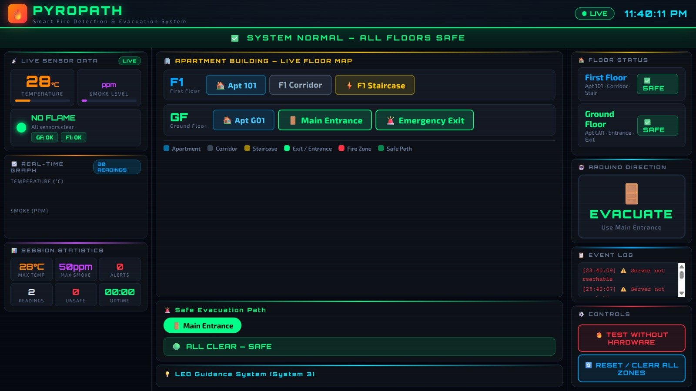

# 🔥 PyroPath – Fire Evacuation and Guidance System

## 📖 Overview

PyroPath is an IoT-based Fire Evacuation and Guidance System designed to enhance safety during fire emergencies. The system continuously monitors flame and smoke levels using sensors connected to ESP32 microcontrollers and provides real-time status updates through a web-based dashboard.

The project aims to provide early fire detection, real-time monitoring, visual alert indications, and evacuation support.

---

## 🎯 Objectives

- Detect fire incidents in real time
- Monitor smoke concentration levels
- Enable wireless communication using ESP32 and Wi-Fi
- Display live sensor data through a web dashboard
- Provide visual alerts through LED indicators
- Support evacuation and emergency decision-making

---

## ✨ Key Features

- 🔥 Real-Time Flame Detection
- 🌫 Smoke Level Monitoring
- 📡 ESP32 Wi-Fi Communication
- 💻 Live Web Dashboard
- 🚨 Fire Alert Indication
- 🔴 Red LED Fire Warning Indicator
- 🟢 Green LED Safe Status Indicator
- 📊 Real-Time Sensor Visualization

---

## 🛠 Hardware Components

| Component | Description |
|------------|------------|
| ESP32 Development Board | Main controller with Wi-Fi capability |
| Flame Sensors | Detect fire presence |
| Smoke Sensor (MQ Series) | Detect smoke concentration |
| Red LED | Indicates fire condition |
| Green LED | Indicates safe condition |
| Lithium Battery | Portable power source |
| Voltage Regulator Module | Provides regulated voltage supply |
| Breadboard | Circuit prototyping |
| Jumper Wires | Electrical connections |

---

## 💻 Software Components

- Arduino IDE
- Node.js
- HTML
- CSS
- JavaScript
- VS Code
- GitHub

---

## 🏛 System Architecture Diagram

## 📊 Flow Diagram

## 🔌 Circuit / Schematic Design

## 📸 Dashboard Screenshot

---

## 🎥 Demo Video

1) prototype: https://drive.google.com/file/d/1YTMxytghquElMXWCm6mjuZVQ2KR56uXr/view?usp=drivesdk
2) Server: https://drive.google.com/file/d/1ZAqyT2rs2YH7wPrGLQYqEx9LLnLddAkG/view?usp=drivesdk
---

## 👥 Team Members

- Abishree S
- Rupha swarna N
- Jeni Varsha B U

---

## 🤝 Project Contribution

PyroPath was developed as a collaborative team project involving hardware integration, firmware development, web dashboard implementation, testing, documentation, and system validation.

---

## 📜 License

This project is developed for academic and educational purposes.
